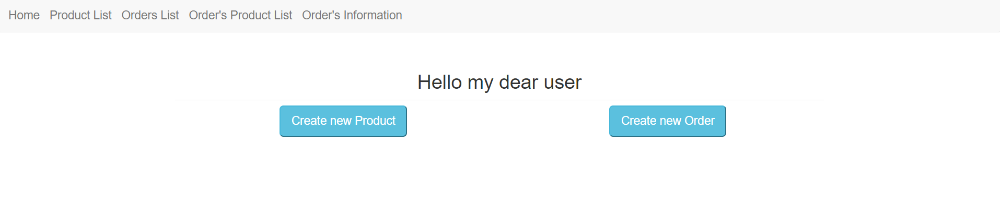

# Hybris Internship Test Task

The starting step to run application
1. Copy repository
2. Open it in your development environment   
3. Set up your DB properties in file application.properties
4. Write http://localhost:7073/ in browser
5. Test application
